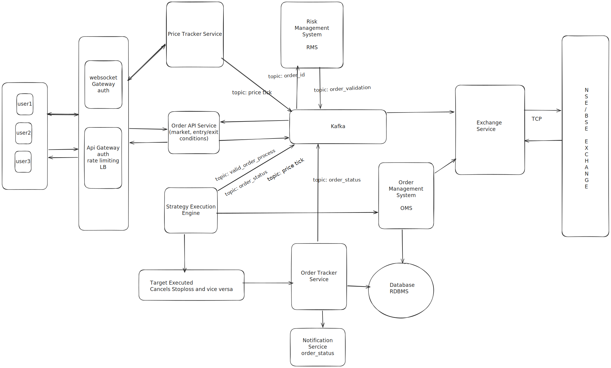

# Stocky-Feature
System design for the Target or stoploss

# Functional Requirements: 
  - User places orders (market order, limit order, stoploss order)- long/ short orders
  - Order must match the price in real time if the price of the stock matches
  - Real-time feedback to the user on the order status

# Non-Functional Requirements:
  - Scalability & low latency
  - High Availability & fault tolerance
  - Data Integrity and Consistency 

# High Level Design

# Architecture Overview

 1) Gateway
    - Handles REST/Websocket connections for user actions, like Login, place an order, and get the market price
    - auth, rate limit, etc.
 2) Order API service
    - Responsible for create/update/delete orders
    - It can be a market order, a limit order, a target order, or long/short orders
 3) Strategy Execution Engine
    - consumes: market price, a valid order produced by RMS, order status
    - Evaluate: entry conditions and exit triggers, also responsible for one successful related order cancels the other
    - Send a valid order based on the trigger to OMS
 4) Event Bus (Kafka)
    - What flows through it
      - Orders
      - Order validation status
      - Order status 
      - RMS decisions
    - Why we used it
      - Decoupling
      - High scalability
  5) RMS
     - responsible to verify order before even used by any module
     - only valid orders would be sent to the next step
  6) OMS
     - Responsible for sending orders to the exchange service
  7) Order Tracker service
     - consumes: order status
     - update the status and exchange order id in the DB
  7) Exchange Service
      - Responsible for all the communication between the Exchange house
      - Maintains TCP sessions with NSE/BSE

Link to the excalidraw for diagram:  https://excalidraw.com/#json=9z1bBbLNlNL-mAFLTaPn9,IEHJQZOI0-4d3SzA_8I8Nw
     
